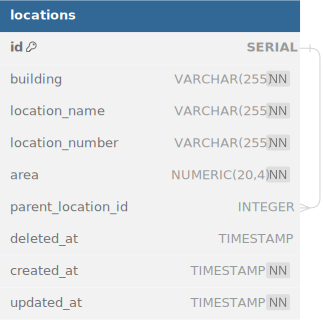

# Documentation for Address Location Coding Test

## Introduction
This document provides an overview of the Address Location Coding Test from Mr. Luc (liam@s3inovate.com)

## Technologies Used
- NestJS: A progressive Node.js framework for building efficient, reliable, and scalable server-side applications.
- PostgreSQL: A powerful, open-source relational database management system.
- TypeORM: An Object-Relational Mapping library that allows developers to interact with databases using TypeScript.
- Swagger: A powerful open-source tool for documenting RESTful APIs.

## Setup
### Installation
1. Clone the repository from GitHub.
2. Install dependencies using `npm install`.
3. Configure environment variables by creating a `.env` file. (copy from `example.env`)

### Database Setup
1. Install PostgreSQL.
2. Create a new database.
3. Set up the database connection in the `.env` file.

### Running the Application
1. Run the application using `npm run start`.
2. Access the Swagger documentation at `http://localhost:3000/api`.

## Business Requirements
[Document PDF - assignment_2024_final.pdf](assignment_2024_final.pdf)

## Data Model
The data model consists of the following fields:
- `id`: The unique identifier of the location.
- `building`: The name of the building where the location is situated.
- `locationName`: The name of the location.
- `locationNumber`: The number/code assigned to the location.
- `area`: The area size of the location in square meters.
- `parentLocationId`: The ID of the parent location if it exists.
- `deletedAt`: The timestamp indicating when the location was soft-deleted.
- `createdAt`: The timestamp indicating when the location was created.
- `updatedAt`: The timestamp indicating when the location was last updated.

## API Endpoints
### Get All Locations
- Endpoint: `/locations`
- Method: GET
- Description: Retrieve a list of all locations.

### Create Location
- Endpoint: `/locations`
- Method: POST
- Description: Create a new location with the specified details.

### Update Location
- Endpoint: `/locations/{id}`
- Method: PUT
- Description: Update details of a location by its ID.

### Delete Location
- Endpoint: `/locations/{id}`
- Method: DELETE
- Description: Delete a location by its ID.

